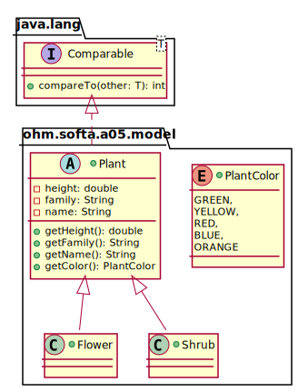
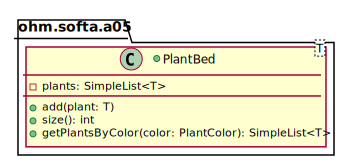

_This is an assignment to the [Software Architecture](https://ohm-softa.github.io) class at the [Technische Hochschule Nürnberg](http://www.th-nuernberg.de)._

# Assignment 5: Generics and Bounds

This assignment covers an advanced topic of generics: bounds on type parameters and wildcards.
Bounds describe type constraints of generic classes or methods that allow to balance type safety with flexibility of use.

## Setup

1. Create a fork of this repository (button in the right upper corner)
2. Clone the project (get the link by clicking the green _Clone or download button_)
3. Import the project to your IDE (remember the guide in assignment 1)
4. Validate your environment by running the tests from your IntelliJ and by running `gradle test` on the command line.

## Groundwork

First, create the model for this assigment:

1. Create the `enum` _PlantColor_
2. Implement the `abstract` class _Plant_
3. Implement the child classes _Flower_ and _Shrub_ 
    _Remarks:_
    - A shrub is always green; a flower may be any color but green (handle a wrong value in the constructor)
    - Flowers compare to each other by height
    - All good data classes should always implement `equals` and `hashCode`, ideally also `toString`.
4. Create tests to ensure that your model classes are correct (e.g. green flowers won't work)

## Basic Bounds

Implement a `PlantBed` which manages a list of plants (use `SimpleList<T>`).

A `PlantBed` may contain any subclass of `Plant` but nothing else!
Use appropriate bounds when declaring the generic class.

_Remarks:_ The method `getPlantsByColor` is very easy to implement if you think of the `filter` method of the `SimpleList`!
Remember to create tests for nearly every line you code!

## Bounds on Wildcards

Last but not least we'll look at the PECS (**P**roducer **E**xtends **C**onsumer **S**uper) principle.

1. Modify the `map` method of the `SimpleList` interface according to the PECS principle
2. Implement the utility method `splitBedByColor` in a utility class `PlantBedUtility`.
	Why should this class be declared `abstract` and have a `private` constructor?

_Remark:_ the above UML diagram for the utility method does not include any bounds but you **need** some (PECS!) -- the compiler is unable to capture the types if you implement the method strictly as described in the UML!
